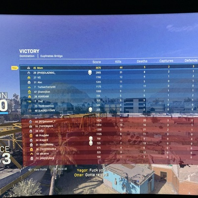

<!DOCTYPE html>
<html lang="en">

<head>

  <meta charset='UTF-8'>
  <meta name="viewport" content="width=device-width, initial-scale=1, shrink-to-fit=no">
  <link rel="shortcut icon" href="img/favicon (1).ico">
  <meta name="description" content="">
  <meta name="author" content="">

  <title>Christopher Do - Counselor</title>

  <!-- Bootstrap core CSS -->
  <link href="vendor/bootstrap/css/bootstrap.min.css" rel="stylesheet">

  <!-- Custom fonts for this template -->
  <link href="https://fonts.googleapis.com/css?family=Saira+Extra+Condensed:500,700" rel="stylesheet">
  <link href="https://fonts.googleapis.com/css?family=Muli:400,400i,800,800i" rel="stylesheet">
  <link href="vendor/fontawesome-free/css/all.min.css" rel="stylesheet">

  <!-- Custom styles for this template -->
  <link href="css/resume.min.css" rel="stylesheet">

</head>

<body id="page-top">
  <nav class="navbar navbar-expand-lg navbar-dark bg-primary fixed-top" id="sideNav">
    <a class="navbar-brand js-scroll-trigger" href="#page-top">
      Christopher Do
      
        
      
    </a>
    <button class="navbar-toggler" type="button" data-toggle="collapse" data-target="#navbarSupportedContent" aria-controls="navbarSupportedContent" aria-expanded="false" aria-label="Toggle navigation">
      
    </button>
    

      <ul class="navbar-nav">
        <li class="nav-item">
          <a class="nav-link js-scroll-trigger" href="#about">About</a>
        </li>
        <li class="nav-item">
          <a class="nav-link js-scroll-trigger" href="#experience">Experience</a>
        </li>
        <li class="nav-item">
          <a class="nav-link js-scroll-trigger" href="#education">Education</a>
        </li>
        <li class="nav-item">
          <a class="nav-link js-scroll-trigger" href="#portfolio">Portfolio</a>
        </li>
      </ul>
    

  

  </nav>

  

    <section class="resume-section p-3 p-lg-5 d-flex align-items-center" id="about">
      

        <h1 class="mb-3">Christopher Do
        </h1>
        
Sociology📚

        
Christopher Do is a 4th year student at the University of California, Riverside where he is majoring in Sociology. His interest in Sociology began during the winter semester of 2017 at his local comminunity college when he took the oportunity to take some sociology classes. He came to the conclusion that this field is what interested him the most after taking two more courses in the field before transferring.  

        Christopher hopes to continue his interest in sociology by branching out and focusing on Race and Ethics, where his interest sparked the most.  

        Whenever he isn't researching or reading articles, he likes to unwind by playing video games, listening and dancing to music, or simply by hanging out with his loved ones. Chris' interests range from anime to sports, which are able to capture his rather short attention span.
        

        

          
          <a target="_blank" href="https://github.com/chrisdo250">
            <i class="fab fa-github"></i>
          </a>
          
          <a target="_blank" href="mailto:chrisdo250@gmail.com">
            <i class="fa fa-envelope"></i>
          </a>
        

      

    </section>

    

    <section class="resume-section p-3 p-lg-5 d-flex justify-content-center" id="experience">
      

        <h2 class="mb-5">Experience</h2>

        

          

            <h3 class="mb-0">Picker</h3>
            
<a target="_blank" href="https://amazon.com">Amazon Fulfilment Center</a>

            

              • Locating merchandise to fulfill picking tickets  
              • Labeling specific inventory types 
              • Stacking deliveries into the delivery vehicle as needed 
            

          

          

            December 2015 - February 2016
          

        

        

          

            <h3 class="mb-0">Merchandise Organizer</h3>
            
<a target="_blank" href="https://www.abercrombie.com/shop/us">Abercrombie & Fitch</a>

            

              • Responsible for stocking and unloading merchandise 
              • Closing shift lead 
            

          

          

            June 2014 - November 2014
          

        

        

          

            <h3 class="mb-0">Volunteer Work: Beach Clean Up</h3>
            
<a target="_blank" href="https://www.saveourbeach.org">Save Our Beach</a>

            

            • Worked for a non-profit organization to clean up Seal Beach 
            • Worked along side almost 100 other peers 
            • Awarded 3rd place for most amount of trash picked up 
            

          

          

          

            June 2014 - July 2014
          

        

      

    </section>

    

    <section class="resume-section p-3 p-lg-5 d-flex align-items-center" id="education">
      

        <h2 class="mb-5">Education</h2>

        

          

            <h3 class="mb-0">UC Riverside</h3>
            
B.A. of Sociology

            
Bachelors degree in Sociology

          

          

            Spring 2020
          

        

        

      

    </section>

    

    <section class="resume-section p-1 p-lg-5 d-flex align-items-center" id="portfolio">
      

        <h2 class="mb-5">Portfolio</h1>
        

            
            
             
             
        

      

    </section>

    

    
&copy;  Christopher Do
 

  

  

  <!-- Bootstrap core JavaScript -->
  
  

  <!-- Plugin JavaScript -->
  

  <!-- Custom scripts for this template -->
  

</body>

</html>

